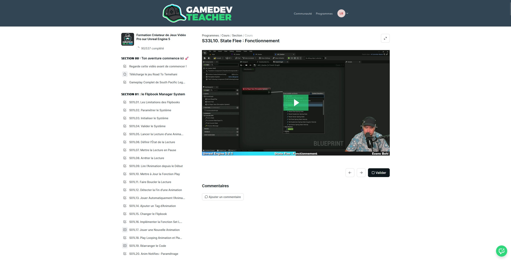
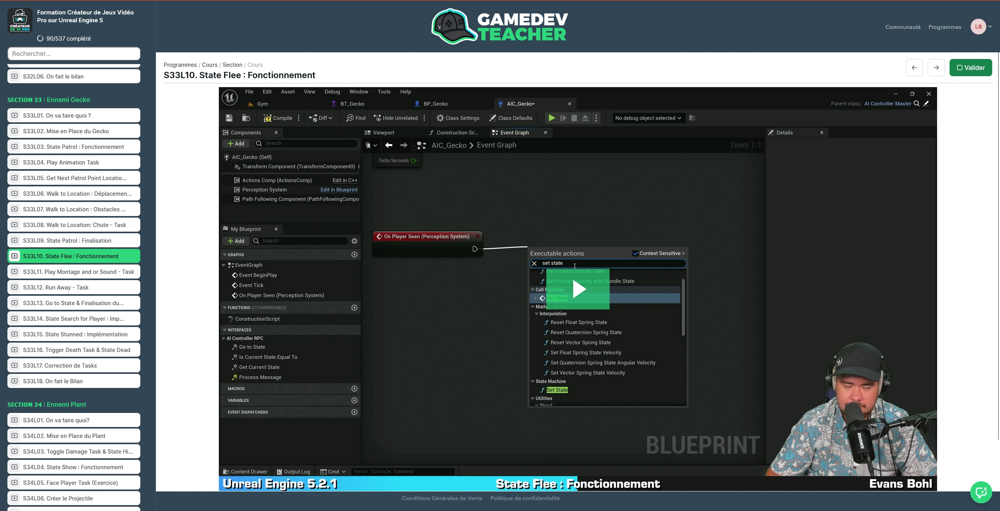
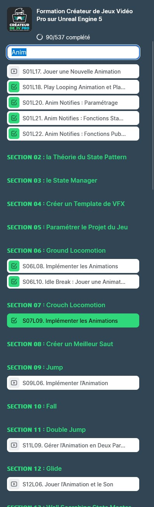
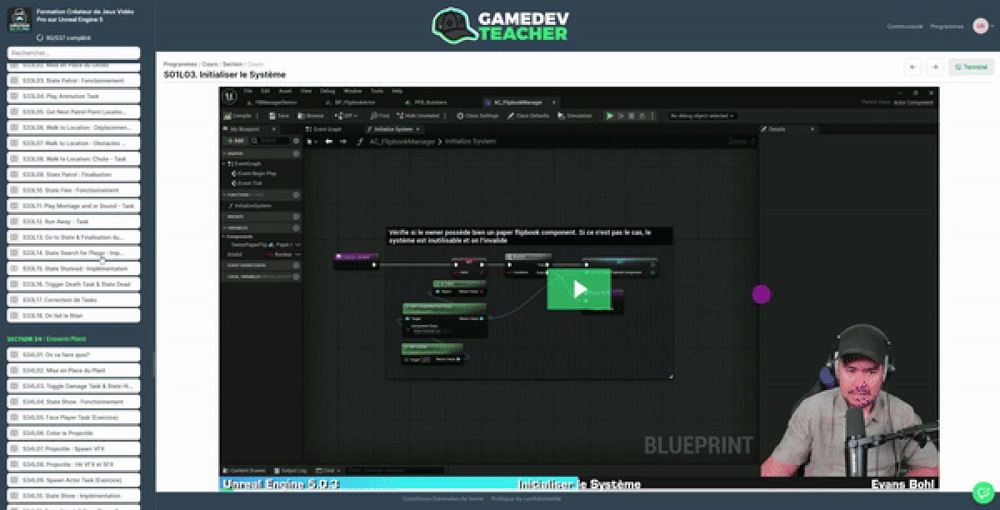

# podia-gamedev-enhancer
This project aim to enhance experience with Podia learning website.
It includes :
- A visual rework of the page
- a script to follow on wich lesson you're currently
- a search field to help you find suject in the long list of video
## Tools required
to avoid making extension for each browser, I decided to use the followinf tools :
- Stylus, a browser extension to rewrite style
   - [Firefox](https://addons.mozilla.org/fr/firefox/addon/styl-us/)
   - [Chrome](https://chromewebstore.google.com/detail/stylus/clngdbkpkpeebahjckkjfobafhncgmne)
- Greasemonkey, an extension to execute javascript on any website
   - [Firefox](https://addons.mozilla.org/fr/firefox/addon/greasemonkey/)
   - For other web browser you can use Violentmonkey that seems compatible, but not tested.
## How to use it
You can use each Script separately, regarding you only need a re styled version of the website, or you want to add Quality of Life features. 
### Stylus - apply new style
- Go to Gamedev Teacher learning Website
- Access your learning page
- Click on stylus extension and create new style for the website
- On the left panel click on Import
- In the new opened window paste the code from Stylus.css
### Greasemonkey - inject script
- Go to Gamedev Teacher learning Website
- Access your learning page
- Click on greasemonkey extension and create new script
- Copy / Paste code from Podia-GamedevTeacherEnhancer.js in the new opened window
- Save and close script
- Now when you click on Greasemonkey script appear in list
- Click on it to edit option, "activate" or "activé" must be dispolayed
- In the "user script option" or "option de script utilisateur", you need to add "https://www.gamedevteacher.fr/*" in the @include block and check the box below to avoid script to be executed on other website.
## Some screens of what you could expect
### Before

### After

### Search and Filter

### Autoscroll & Highlight on chapter
