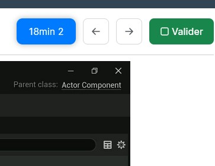

# podia-gamedev-enhancer - made with ❤️
This project aim to enhance experience with Podia learning website.
It includes :
- A visual rework of the page
- a script to follow on wich lesson you're currently
- a search field to help you find suject in the long list of video
## ⚠️ Updates ⚠️
- added a Tampermonkey version that is more stable than greasemonkey
   - this version is file named GameDevTeacher Podia Enhancer-2024-03-19.user.js that you can import directly in tampermonkey in utility > file > import, or copy/paste code.
- try to add video duration, but still buggy, regarding time to Wistia to load.
   - If I had enough time, I'll try to fix it, any help is welcome
- added an automatic go to next lesson on validate, see source code comments to disable it if you prefere
- updated Style to be able to add video duration just before navigation buttons
   - if you deactivate videoplayer - beta script you can avoid to update style.
## Tools required
to avoid making extension for each browser, I decided to use the followinf tools :
- Stylus, a browser extension to rewrite style
   - [Firefox](https://addons.mozilla.org/fr/firefox/addon/styl-us/)
   - [Chrome](https://chromewebstore.google.com/detail/stylus/clngdbkpkpeebahjckkjfobafhncgmne)
- Tampermonkey, an extension to execute javascript on any website (Recommended)
   - [Firefox](https://addons.mozilla.org/fr/firefox/addon/tampermonkey/)
   - [Chrome](https://chromewebstore.google.com/detail/tampermonkey/dhdgffkkebhmkfjojejmpbldmpobfkfo)
- Greasemonkey, an extension to execute javascript on any website
   - [Firefox](https://addons.mozilla.org/fr/firefox/addon/greasemonkey/)
   - For other web browser you can use Violentmonkey that seems compatible, but not tested.
   Stylus & Tampermonkey are also available on Edge via Chrome store (thx Julien F. for the info)
## How to use it
You can use each Script separately, regarding you only need a re styled version of the website, or you want to add Quality of Life features. 
### Stylus - apply new style
- Go to Gamedev Teacher learning Website
- Access your learning page
- Click on stylus extension and create new style for the website
- On the left panel click on Import
- In the new opened window paste the code from Stylus.css
### Greasemonkey - inject script (will be deprecated cause too much unstable)
- Go to Gamedev Teacher learning Website
- Access your learning page
- Click on greasemonkey extension and create new script
- Copy / Paste code from Podia-GamedevTeacherEnhancer.js in the new opened window
- Save and close script
- Now when you click on Greasemonkey script appear in list
- Click on it to edit option, "activate" or "activé" must be dispolayed
- In the "user script option" or "option de script utilisateur", you need to add "https://www.gamedevteacher.fr/*" in the @include block and check the box below to avoid script to be executed on other website.
### Tampermonkey - alt inject script
 - If you import file, all will be made automaticly
 - If you copy/paste code, don't forget to add @match https://www.gamedevteacher.fr/view/courses/creajv-pro/* at the top of the file to activate it for all training website.
## Some screens of what you could expect
### Before

### After

### Search and Filter

### Autoscroll & Highlight on chapter

### Video duration
